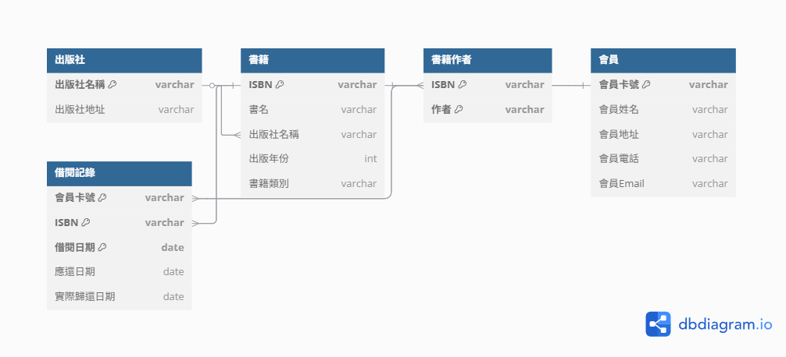

# Lab-05_1：圖書館資料庫設計

## 情境：

請為圖書館設計資料庫。圖書館需要追蹤書籍、會員以及借閱記錄。

## 資料基本包含：

* 書籍：ISBN、書名、作者 (可能多位)、出版社名稱、出版社地址、出版年份、書籍類別。
* 會員：會員卡號、會員姓名、會員地址、會員電話、會員Email。
* 借閱：會員卡號、會員姓名、ISBN、書名、借閱日期、應還日期、實際歸還日期。

---

## 任務：

### 1. 識別問題與函數相依性

#### 初始未正規化資料表分析

我們有一個包含所有資訊的扁平化資料表：

| ISBN | 書名 | 作者 | 出版社名稱 | 出版社地址 | 出版年份 | 書籍類別 | 會員卡號 | 會員姓名 | 會員地址 | 會員電話 | 會員Email | 借閱日期 | 應還日期 | 實際歸還日期 |
|------|------|------|-----------|-----------|---------|---------|---------|---------|---------|---------|-----------|---------|---------|-------------|

#### 潛在問題識別

分析上述初步收集的資料，找出潛在的**資料重複**、**插入異常**、**更新異常**和**刪除異常**。

1. **資料重複性 (Data Redundancy)**：
   - 書籍資訊在每次借閱時都會重複
   - 會員資訊在每次借閱時都會重複
   - 出版社資訊對每本同出版社的書都會重複

2. **插入異常 (Insertion Anomaly)**：
   - 無法在沒有借閱記錄的情況下添加新書籍
   - 無法在沒有借閱記錄的情況下添加新會員

3. **更新異常 (Update Anomaly)**：
   - 如果會員資訊變更，需要更新所有該會員的借閱記錄
   - 如果書籍資訊變更，需要更新所有相關的借閱記錄

4. **刪除異常 (Deletion Anomaly)**：
   - 刪除借閱記錄可能導致書籍或會員資訊遺失

#### 函數相依性列表

列出所有合理的函數相依性。

```
FD1: ISBN → 書名, 出版社名稱, 出版年份, 書籍類別
FD2: 出版社名稱 → 出版社地址
FD3: 會員卡號 → 會員姓名, 會員地址, 會員電話, 會員Email
FD4: (會員卡號, ISBN, 借閱日期) → 應還日期, 實際歸還日期
FD5: ISBN → 作者 (多值相依，一本書可能有多位作者)
```

---

### 2. 正規化設計

將資料庫綱要 (Schema) 正規化至第三正規化 (3NF)。如果可以，嘗試達到 BCNF。

* **第一正規化 (1NF)**：消除多值屬性，處理作者可能多位的問題。

    * **書籍資料表 (1NF)**：

    | ISBN | 書名 | 出版社名稱 | 出版年份 | 書籍類別 |
    | ---- | -- | ----- | ---- | ---- |

    * **書籍作者資料表 (1NF)**：

    | ISBN | 作者 |
    | ---- | -- |

    * **會員資料表 (1NF)**：

    | 會員卡號 | 會員姓名 | 會員地址 | 會員電話 | 會員Email |
    | ---- | ---- | ---- | ---- | ------- |

    * **借閱記錄資料表 (1NF)**：

    | 會員卡號 | ISBN | 借閱日期 | 應還日期 | 實際歸還日期 |
    | ---- | ---- | ---- | ---- | ------ |

* **第二正規化 (2NF)**：所有資料表的主鍵都是單一欄位或完全相依，已符合2NF。

* **第三正規化 (3NF)**：消除傳遞相依性 (例如：出版社名稱 → 出版社地址)。

    * **出版社資料表 (3NF)**：

    | 出版社名稱 | 出版社地址 |
    | ----- | ----- |

    * **書籍資料表 (3NF)**：
    
    | ISBN | 書名 | 出版社名稱 | 出版年份 | 書籍類別 |
    | ---- | -- | ----- | ---- | ---- |

* **Boyce-Codd 正規化 (BCNF)**：所有函數相依性的決定因子都是候選鍵。檢查後，本系統所有表格皆已達到 BCNF 規則。

---

### 3. 分析與說明

簡要說明您的正規化過程，以及每個步驟的理由。

1. **1NF轉換**：將多值屬性（作者）分解到獨立資料表。
2. **2NF轉換**：所有非主鍵屬性都完全相依於主鍵。
3. **3NF轉換**：消除傳遞相依性，將出版社資訊獨立出來。
4. **BCNF驗證**：所有函數相依性的決定因子都是超鍵。

---

### 4. 最終ERD結構

```
出版社 (出版社名稱[PK], 出版社地址)
    ↓ 1:N
書籍 (ISBN[PK], 書名, 出版社名稱[FK], 出版年份, 書籍類別)
    ↓ 1:N
書籍作者 (ISBN[PK][FK], 作者[PK])
    
會員 (會員卡號[PK], 會員姓名, 會員地址, 會員電話, 會員Email)
    ↓ 1:N
借閱記錄 (會員卡號[PK][FK], ISBN[PK][FK], 借閱日期[PK], 應還日期, 實際歸還日期)
```

---

### 5. 實體關係圖 (ERD)

繪製最終的實體關係圖 (ERD)。

* 繪圖工具：**dbdiagram.io**
    * 依照上面的 **ERD 結構**，轉成 dbdiagram.io 的 DSL 語法，就可以直接生成**實體關係圖 (ERD)**。
    * 連結：[https://dbdiagram.io](https://dbdiagram.io)



---

