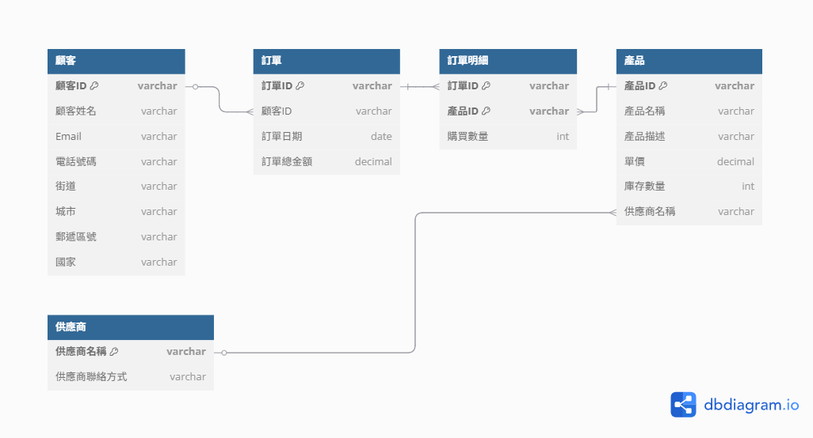

# Lab-05_2：線上商店訂單系統

## 情境：

一家小型線上商店需要一個系統來管理顧客、產品和訂單。

## 資料基本包含：

* 顧客：顧客ID、顧客姓名、Email、電話號碼、完整送貨地址 (街道、城市、郵遞區號、國家)。
* 產品：產品ID、產品名稱、產品描述、單價、庫存數量、供應商名稱、供應商聯絡方式。
* 訂單：訂單ID、顧客ID、顧客姓名、訂單日期、訂單總金額、產品ID (多個)、產品名稱 (多個)、購買數量 (對應每個產品)、單價 (對應每個產品)。

---

## 任務：

### 1. 初始未正規化資料表分析

我們有一個包含所有資訊的扁平化資料表：

| 顧客ID | 顧客姓名 | Email | 電話號碼 | 街道 | 城市 | 郵遞區號 | 國家 | 供應商名稱 | 供應商聯絡方式 | 產品ID | 產品名稱 | 產品描述 | 單價 | 庫存數量 | 訂單ID | 訂單日期 | 訂單總金額 | 購買數量 |
| ---- | ---- | ----- | ---- | -- | -- | ---- | -- | ----- | ------- | ---- | ---- | ---- | -- | ---- | ---- | ---- | ----- | ---- |

---

### 2. 函數相依性列表

列出所有合理的函數相依性。

```
FD1: 顧客ID → 顧客姓名, Email, 電話號碼, 街道, 城市, 郵遞區號, 國家
FD2: 產品ID → 產品名稱, 產品描述, 單價, 庫存數量, 供應商名稱
FD3: 供應商名稱 → 供應商聯絡方式
FD4: 訂單ID → 顧客ID, 訂單日期, 訂單總金額
FD5: (訂單ID, 產品ID) → 購買數量
```

---

### 3. 正規化設計

將資料庫綱要 (Schema) 正規化至第三正規化 (3NF)。

* **第一正規化 (1NF)**：分解扁平化資料表，消除重複群組。

    * **訂單資料表 (1NF)**：

    | 訂單ID | 顧客ID | 顧客姓名 | Email | 電話號碼 | 街道 | 城市 | 郵遞區號 | 國家 | 訂單日期 | 訂單總金額 |
    | ---- | ---- | ---- | ----- | ---- | -- | -- | ---- | -- | ---- | ----- |

    * **訂單明細資料表 (1NF)**：

    | 訂單ID | 產品ID | 產品名稱 | 產品描述 | 單價 | 庫存數量 | 供應商名稱 | 供應商聯絡方式 | 購買數量 |
    | ---- | ---- | ---- | ---- | -- | ---- | ----- | ------- | ---- |

* **第二正規化 (2NF)**：消除部分相依性，產品資訊只相依於產品ID。

    * **訂單資料表 (2NF)**：

    | 訂單ID | 顧客ID | 顧客姓名 | Email | 電話號碼 | 街道 | 城市 | 郵遞區號 | 國家 | 訂單日期 | 訂單總金額 |
    | ---- | ---- | ---- | ----- | ---- | -- | -- | ---- | -- | ---- | ----- |

    * **產品資料表 (2NF)**：

    | 產品ID | 產品名稱 | 產品描述 | 單價 | 庫存數量 | 供應商名稱 | 供應商聯絡方式 |
    | ---- | ---- | ---- | -- | ---- | ----- | ------- |

    * **訂單明細資料表 (2NF)**：

    | 訂單ID | 產品ID | 購買數量 |
    | ---- | ---- | ---- |

* **第三正規化 (3NF)**：消除傳遞相依性。

    * **顧客資料表 (3NF)**：

    | 顧客ID | 顧客姓名 | Email | 電話號碼 | 街道 | 城市 | 郵遞區號 | 國家 |
    | ---- | ---- | ----- | ---- | -- | -- | ---- | -- |

    * **供應商資料表 (3NF)**：

    | 供應商名稱 | 供應商聯絡方式 |
    | ----- | ------- |

    * **產品資料表 (3NF)**：

    | 產品ID | 產品名稱 | 產品描述 | 單價 | 庫存數量 | 供應商名稱\[FK] |
    | ---- | ---- | ---- | -- | ---- | ---------- |

    * **訂單資料表 (3NF)**：

    | 訂單ID | 顧客ID\[FK] | 訂單日期 | 訂單總金額 |
    | ---- | --------- | ---- | ----- |

    * **訂單明細資料表 (3NF)**：
    
    | 訂單ID\[FK] | 產品ID\[FK] | 購買數量 |
    | --------- | --------- | ---- |

---

### 4. 分析與說明

簡要說明您的正規化過程，以及每個步驟的理由。

1. **1NF轉換**：將包含多個產品的訂單分解為訂單主檔和訂單明細。
2. **2NF轉換**：將產品資訊從訂單明細中分離，消除部分相依性。
3. **3NF轉換**：分離顧客資訊和供應商資訊，消除傳遞相依性。

### 5. 最終ERD結構

```
顧客 (顧客ID[PK], 顧客姓名, Email, 電話號碼, 街道, 城市, 郵遞區號, 國家)
    ↓ 1:N
訂單 (訂單ID[PK], 顧客ID[FK], 訂單日期, 訂單總金額)
    ↓ 1:N
訂單明細 (訂單ID[PK][FK], 產品ID[PK][FK], 購買數量)
                             ↑ N:1
產品 (產品ID[PK], 產品名稱, 產品描述, 單價, 庫存數量, 供應商名稱[FK])
    ↑ N:1
供應商 (供應商名稱[PK], 供應商聯絡方式)
```

---

### 6. 實體關係圖 (ERD)

繪製最終的實體關係圖 (ERD)。

* 繪圖工具：**dbdiagram.io**
    * 依照上面的 **ERD 結構**，轉成 dbdiagram.io 的 DSL 語法，就可以直接生成**實體關係圖 (ERD)**。
    * 連結：[https://dbdiagram.io](https://dbdiagram.io)



---